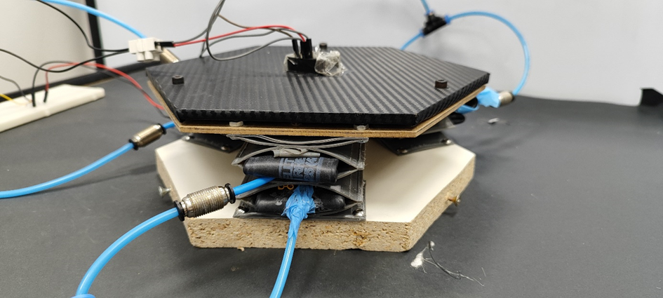
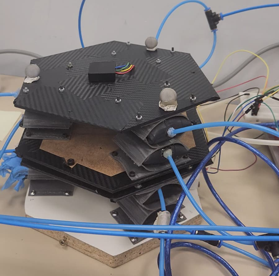
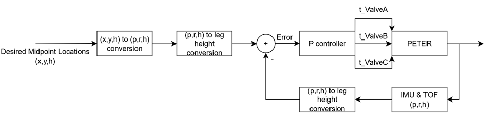
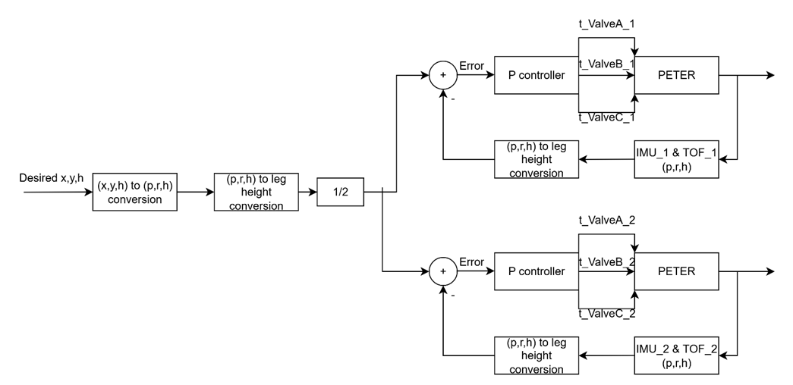
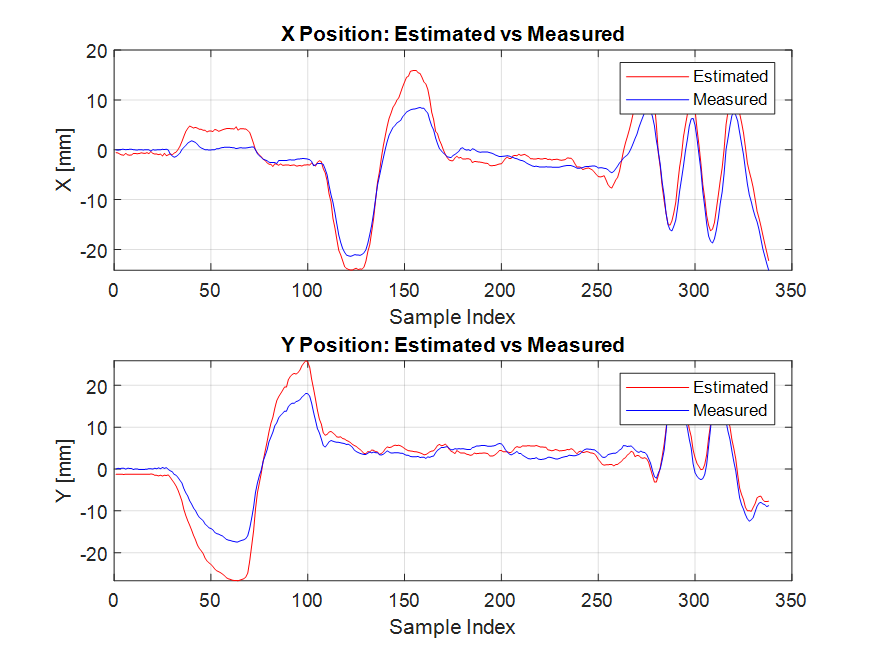

# PETER — Soft-Pneumatic Modular Platform (Closed-Loop Control)

**Summer Research Project — Universidad Politécnica de Madrid (UPM), CAR Robotics & Cybernetics**  
**Period:** June 2025 – July 2025  
**Researcher:** Emirhan Yolcu (METU)  
**Mentor:** Jorge Garcia Samartin (PhD)  
**Supervisor:** Prof. Dr. Antonio Barrientos

---

## 🎯 Introduction

PETER is a modular soft-pneumatic platform capable of regulating its pose (pitch–roll–height) using inflatable legs with sensor-based closed-loop control. The system was first implemented in a **single-module configuration**, then extended to a **two-module architecture** with independent sensing and actuation.

The primary objective of the internship was to develop the full kinematic control pipeline, implement real-time feedback stabilization, and perform validation using OptiTrack motion capture.

---

## ⚙️ System Overview

The platform consists of:
- Three soft-pneumatic legs per module  
- IMU and ToF sensing for orientation and height feedback  
- MATLAB-based inverse/forward kinematic mapping  
- Arduino for valve actuation and sensor interfacing  
- Optional multi-module architecture with shared Cartesian commands

---

## 🧭 Single-Module Closed-Loop Architecture

Workflow:
1) Desired (x,y,h) → `xyh_to_prh` → (p,r,h)  
2) (p,r,h) → `prh_to_leg_heights` → target legs  
3) IMU+ToF → measured (p,r,h)  
4) Error computed → P controller → valve commands

---

## 🧩 Two-Module Architecture

In the dual-module setup:
- Top-level leg lengths are split across both modules  
- Each module has its **own IMU + ToF** and closes its own loop  
- I²C conflicts are resolved with hardware & software re-addressing

---

## 🧮 Kinematic Functions

- `xyh_to_prh` — inverse mapping (nonlinear cost minimization with `fminsearch`)
- `prh_to_leg_heights` — Rodrigues-based forward kinematics for actuator lengths
- `prh_to_xyh` — Cartesian back-projection for validation & monitoring

These three functions form the computational backbone of the controller.

---

## ✅ Validation & Experiments

Two validation stages were conducted:

**1) Disturbance Rejection Test at (0,0)**  
https://youtube.com/shorts/rUIRMNMMSJA?feature=share

**2) OptiTrack Laboratory Validation**  
Measured pose vs ground-truth comparison:

IMU signals were stable enough for control, whereas ToF noise was significant — suggesting alternative height sensing.

---

## 📄 Full Report (PDF)

[📄 **Open Full Report**](PETER_Project_Summer_Internship_Report.pdf)

---

## 🚀 Future Work

- System identification of PETER for model-based control  
- LQR / PD / filtered PI / anti-windup trials  
- I²C multiplexer for robust sensor integration  
- Alternative height sensing beyond ToF  
- Expansion beyond two-module architecture

---

## 🏛️ Credits

Conducted at **UPM — CAR Robotics & Cybernetics Laboratory**  
Mentored by **Jorge Garcia Samartin** — Supervised by **Prof. Antonio Barrientos**

---
